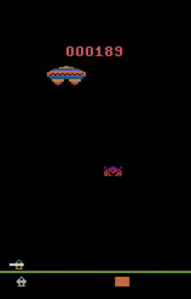

# OpenAIGymPlayground
> In this subfolder I will be showing scripts that solve the games of [OpenAI gyms library.](https://gym.openai.com/)

## Structure
- In [Assault-v0](./Assault-v0/) is a script that build a reinforcement model that will play the atari game [assault-v0](https://gym.openai.com/envs/Assault-v0/). <br/>

## Detailed Build Setup

```bash
# install dependencies
pip install -r requirements
```